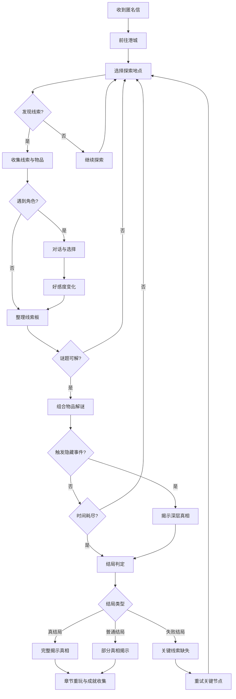

## 1. 产品概述

《雾港来信》是一款桌面文字冒险游戏，玩家扮演收到匿名信的图书修复师，在港城七个地点寻找失踪作家的手稿。游戏融合探索、推理、角色互动与多结局分支，打造沉浸式悬疑叙事体验。

- 核心价值：通过分支叙事、线索推理与角色好感系统，让每位玩家获得独特的悬疑冒险体验
- 目标用户：喜爱文字冒险、推理悬疑、叙事驱动游戏的玩家

## 2. 核心功能

### 2.1 用户角色

| 角色 | 说明 | 核心特征 |
|------|------|----------|
| 玩家（图书修复师） | 主角，收到匿名信后踏上寻稿之旅 | 可自定义姓名，决定分支走向 |
| 陈守谦 | 失踪作家，港城文学界传奇人物 | 通过回忆碎片逐步揭示其秘密 |
| 林雪晴 | 旧书店老板，知情人之一 | 好感影响关键线索获取 |
| 赵鹤年 | 港口码头老水手 | 提供航海日志与关键物证 |
| 苏敏华 | 图书馆馆长 | 掌握手稿借阅记录 |
| 何振邦 | 侦探，暗中调查案件 | 好感决定合作或对抗走向 |

### 2.2 功能模块

1. **主界面**：故事叙述、场景描写、分支选择、时间显示
2. **地图窗口**：七地点导航、解锁状态、当前地点标记
3. **对话窗口**：角色对话、好感度显示、分支对话选项
4. **物品窗口**：物品收集、物品组合、物品详情查看
5. **线索板窗口**：线索钉板、线索关联、推理笔记
6. **档案窗口**：日记自动记录、已解锁文档、成就列表
7. **结局回顾窗口**：多结局回顾、章节重玩、关键选择标记

### 2.3 七大探索地点

| 地点 | 描述 | 关联角色 | 核心线索 |
|------|------|----------|----------|
| 旧墨书店 | 古旧书店，林雪晴经营 | 林雪晴 | 作家早期手稿片段 |
| 港口码头 | 雾气弥漫的老码头 | 赵鹤年 | 航海日志残页 |
| 市立图书馆 | 庄严的古典图书馆 | 苏敏华 | 借阅记录与密函 |
| 雾港旅馆 | 神秘的老旅馆 | 何振邦 | 旅客登记簿 |
| 灯塔崖岸 | 伫立灯塔的悬崖 | 无 | 灯塔密码与暗号 |
| 渔人小巷 | 幽深曲折的巷弄 | 无 | 街头涂鸦与暗语 |
| 废弃印刷厂 | 荒废的印刷工坊 | 无 | 印刷模板与隐藏手稿 |

### 2.4 页面详情

| 页面名称 | 模块名称 | 功能描述 |
|----------|----------|----------|
| 主界面 | 故事叙述区 | 展示场景描写文本，支持逐字显示与回放 |
| 主界面 | 分支选择区 | 呈现2-3个选项，标记关键选择 |
| 主界面 | 时间面板 | 显示当前游戏时间（日期+时段），时间随行动推进 |
| 主界面 | 快捷导航栏 | 一键切换地图/物品/线索板等窗口 |
| 地图窗口 | 港城地图 | 可视化七地点位置，点击前往 |
| 地图窗口 | 地点信息 | 展示地点描述、解锁条件、探索进度 |
| 对话窗口 | 对话面板 | 角色立绘+对话框，逐句呈现 |
| 对话窗口 | 好感度条 | 显示当前角色好感等级与数值 |
| 对话窗口 | 对话选项 | 影响好感与剧情走向的分支选项 |
| 物品窗口 | 物品列表 | 网格展示已收集物品图标 |
| 物品窗口 | 组合面板 | 拖拽两个物品尝试组合 |
| 物品窗口 | 物品详情 | 弹窗展示物品描述与使用提示 |
| 线索板窗口 | 钉板画布 | 可自由拖拽排列线索卡片 |
| 线索板窗口 | 连线工具 | 在线索间绘制关联线 |
| 线索板窗口 | 推理笔记 | 文本输入区记录推理思路 |
| 档案窗口 | 日记页签 | 按时间线自动记录事件与发现 |
| 档案窗口 | 文档页签 | 已解锁的信件、手稿等原文 |
| 档案窗口 | 成就页签 | 成就列表与解锁状态 |
| 结局回顾窗口 | 结局画廊 | 展示已解锁结局，含插图与概述 |
| 结局回顾窗口 | 章节选择 | 通关后可重玩任意章节 |
| 结局回顾窗口 | 选择回顾 | 标记关键选择节点与后果 |

## 3. 核心流程

玩家收到匿名信 → 阅读信件决定前往港城 → 探索七大地点收集线索与物品 → 与角色对话提升好感获取关键信息 → 组合物品解开谜题 → 在线索板上整理推理 → 触发隐藏事件揭示真相 → 根据好感/线索/选择达成不同结局 → 失败可重试关键节点 → 通关后可重玩章节探索其他分支

## 4. 用户界面设计

### 4.1 设计风格

- **主色调**：深墨蓝(#1a1f2e)为底，配合旧纸黄(#d4b896)文字与雾灰(#6b7280)辅助色，营造雾港悬疑氛围
- **强调色**：信件红(#c0392b)用于关键提示与选择高亮
- **按钮风格**：仿旧纸质按钮，圆角微磨砂边框，hover时微泛光
- **字体**：标题使用"ZCOOL XiaoWei"（站酷小薇体），正文使用"Noto Serif SC"（思源宋体）
- **布局**：左主叙事区 + 右侧功能面板的经典文字冒险布局
- **图标风格**：手绘墨线风格图标
- **动画**：文字逐字淡入、场景切换雾气过渡、线索钉板微晃动

### 4.2 页面设计概览

| 页面名称 | 模块名称 | UI元素 |
|----------|----------|--------|
| 主界面 | 故事叙述区 | 暗色半透明面板、宋体逐字显示、段落间距呼吸感 |
| 主界面 | 分支选择区 | 仿信纸选项卡、关键选择带红色标记 |
| 主界面 | 时间面板 | 右上角钟表图标+日期时段文字 |
| 地图窗口 | 港城地图 | 手绘风格地图、地点圆点带雾气效果 |
| 对话窗口 | 对话面板 | 角色头像框+对话框气泡、好感心形图标 |
| 物品窗口 | 物品列表 | 网格卡片、物品图标+名称、稀有度边框色 |
| 线索板窗口 | 钉板画布 | 仿软木板背景、图钉图标、可拖拽线索卡 |
| 档案窗口 | 日记页签 | 翻页效果的日记本、墨迹装饰 |
| 结局回顾窗口 | 结局画廊 | 卡片式结局展示、锁定/解锁状态区分 |

### 4.3 响应式策略

- 桌面优先设计，最小支持1280×720分辨率
- 主区域固定宽度叙事，侧面板可折叠
- 窗口化弹出面板，支持拖拽定位

### 4.4 游戏系统设计

| 系统 | 说明 |
|------|------|
| 时间推进 | 每次探索/对话消耗1个时段，每日4时段，共7天28时段 |
| 好感系统 | 4级好感（陌生/友善/信任/亲密），影响对话深度与结局 |
| 物品组合 | 特定物品对可组合产生新道具，提示谜题解法 |
| 线索钉板 | 自由排列线索卡+连线关联，整理推理思路 |
| 日记自动记录 | 每次事件自动追加日记条目，可回顾 |
| 隐藏事件 | 特定条件触发（好感+物品+时间组合） |
| 谜题提示 | 卡关时消耗好感获取提示 |
| 存档读档 | 3个存档位，localStorage持久化 |
| 文本回放 | 查看当前场景已显示的文本历史 |
| 背景音切换 | 3种氛围音效（港口/雨夜/安静），可开关 |
| 成就收集 | 15+成就，涵盖探索/对话/组合/结局等 |
| 多结局判定 | 基于好感总和、关键线索收集、分支选择综合判定 |
| 失败重试 | 失败结局后可回到最近关键选择节点 |
| 关键选择标记 | 重要选择标记星号，结局回顾中可查看 |
| 章节重玩 | 通关后按章节重玩，保留全局成就 |
