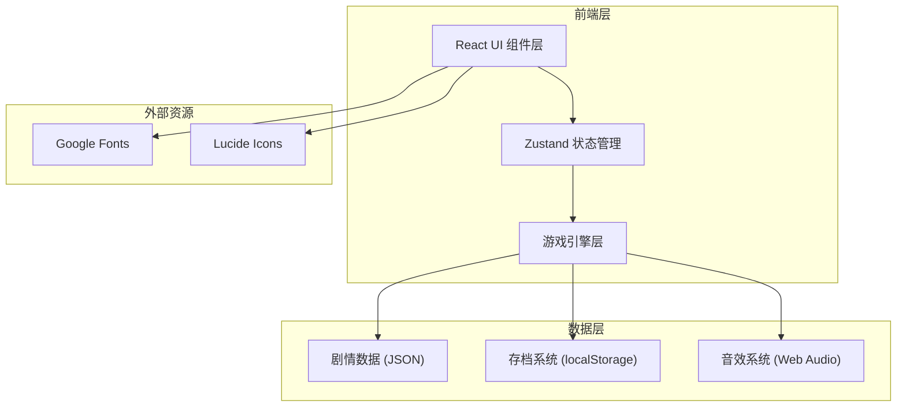
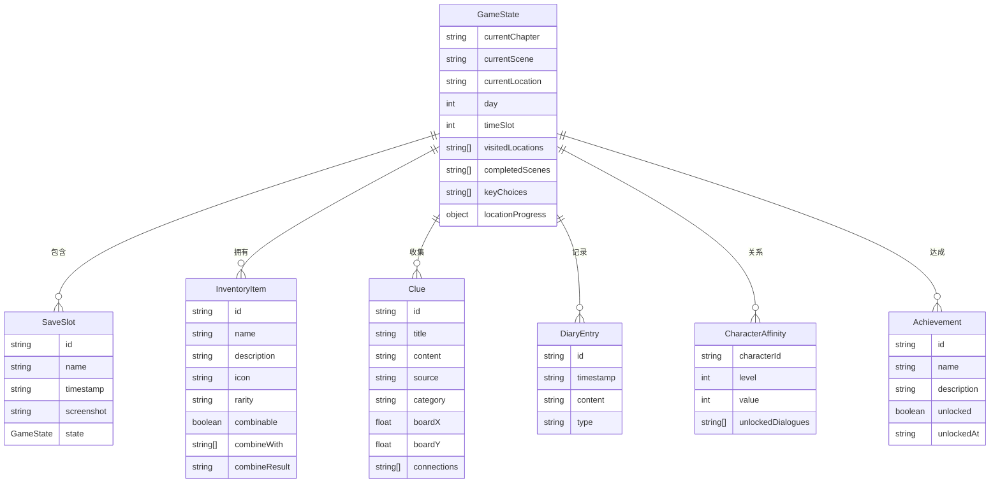

## 1. 架构设计



## 2. 技术说明

- **前端框架**：React@18 + TypeScript + Vite
- **初始化工具**：Vite (create-vite)
- **样式方案**：Tailwind CSS@3 + CSS Variables 主题系统
- **状态管理**：Zustand（轻量、无样板代码、支持持久化中间件）
- **动画**：CSS Transitions/Keyframes + Framer Motion
- **图标**：Lucide React
- **字体**：Google Fonts (ZCOOL XiaoWei + Noto Serif SC)
- **音效**：Web Audio API（程序化生成氛围音）
- **持久化**：localStorage（存档/读档/成就/设置）
- **后端**：无（纯前端单机游戏）
- **数据库**：无（所有数据内嵌JSON）

## 3. 路由定义

| 路由 | 用途 |
|------|------|
| / | 游戏主界面（含所有面板窗口） |
| /title | 标题画面（开始/继续/设置） |
| /ending | 结局画面（结局展示与回顾） |

## 4. 数据模型

### 4.1 游戏状态模型



### 4.2 剧情数据结构

游戏剧情使用JSON数据驱动，核心结构：

- **Chapter（章节）**：包含多个Scene
- **Scene（场景）**：包含叙述文本、选择项、触发条件
- **Dialogue（对话）**：角色对话序列，含分支选项
- **Event（事件）**：条件触发的隐藏事件

## 5. 项目目录结构

```
src/
├── components/          # UI组件
│   ├── windows/         # 七大窗口组件
│   │   ├── MainWindow.tsx
│   │   ├── MapWindow.tsx
│   │   ├── DialogueWindow.tsx
│   │   ├── ItemWindow.tsx
│   │   ├── ClueBoardWindow.tsx
│   │   ├── ArchiveWindow.tsx
│   │   └── EndingWindow.tsx
│   ├── ui/              # 通用UI组件
│   │   ├── Window.tsx
│   │   ├── Button.tsx
│   │   └── Modal.tsx
│   └── layout/          # 布局组件
├── store/               # Zustand状态管理
│   ├── gameStore.ts
│   ├── uiStore.ts
│   └── achievementStore.ts
├── engine/              # 游戏引擎
│   ├── storyEngine.ts
│   ├── timeSystem.ts
│   ├── affinitySystem.ts
│   ├── puzzleSystem.ts
│   └── endingSystem.ts
├── data/                # 剧情数据
│   ├── chapters/
│   ├── items.ts
│   ├── characters.ts
│   ├── locations.ts
│   ├── clues.ts
│   └── achievements.ts
├── audio/               # 音效系统
│   └── ambientAudio.ts
├── hooks/               # 自定义Hooks
├── types/               # TypeScript类型定义
├── utils/               # 工具函数
├── styles/              # 全局样式
├── App.tsx
└── main.tsx
```

## 6. 核心系统设计

### 6.1 时间系统

- 7天 × 4时段（清晨/午后/黄昏/深夜）= 28时段
- 每次探索消耗1时段，对话消耗0.5时段（取整）
- 特定事件仅在特定时段触发
- 时段耗尽进入下一天，第7天深夜触发结局判定

### 6.2 好感系统

- 每位角色好感值0-100，映射4个等级
- 对话选项影响好感±5~20
- 好感等级解锁不同对话深度与关键线索
- 好感总和参与结局判定

### 6.3 物品组合系统

- 预定义组合配方（如"残页A+残页B=完整信件"）
- 在物品窗口选择两个物品尝试组合
- 成功组合产生新物品并记录成就
- 组合失败给予提示

### 6.4 线索钉板系统

- 基于Canvas或DOM拖拽实现
- 线索卡片可自由拖拽排列
- 卡片间可绘制连线表示关联
- 支持添加文字推理笔记
- 钉板状态持久化到存档

### 6.5 结局判定系统

- 真结局：全部关键线索收集 + 好感总和达标 + 关键选择正确
- 普通结局A/B/C：不同维度的部分达成
- 失败结局：关键线索缺失或时间耗尽未完成核心任务
- 隐藏结局：特定隐藏事件触发

### 6.6 存档系统

- 3个存档位，存储完整GameState快照
- 自动存档 + 手动存档
- 存档包含时间戳与当前场景描述
- localStorage持久化，JSON序列化
